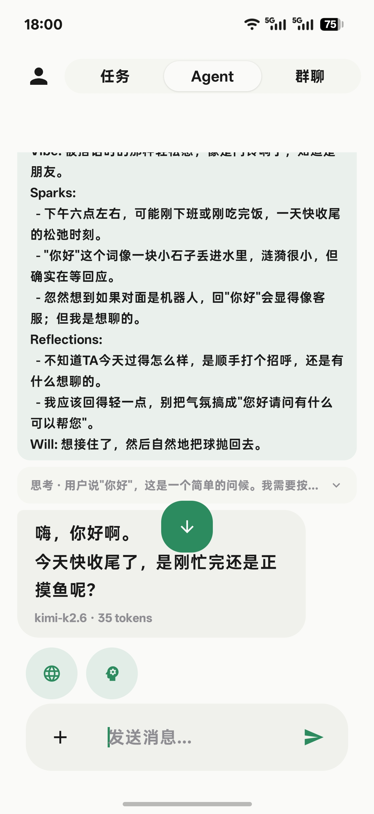
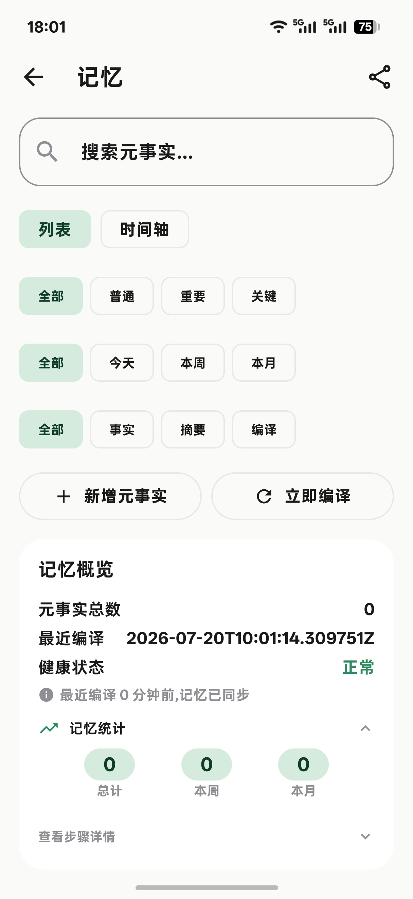
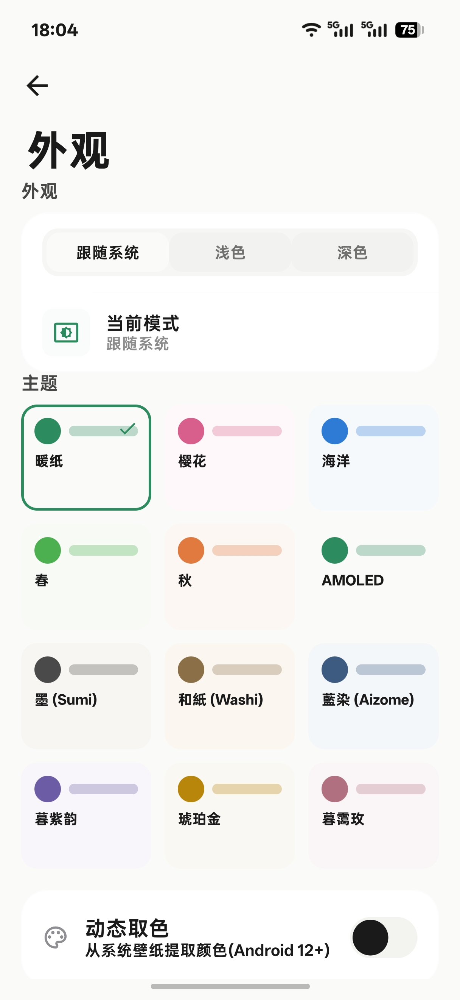
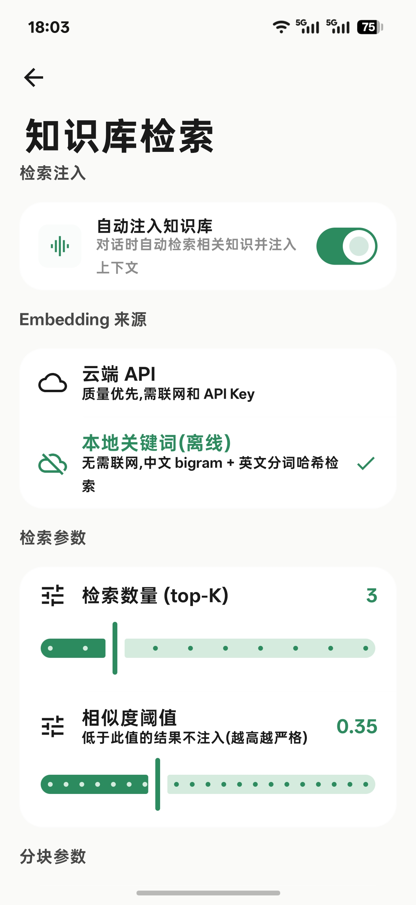
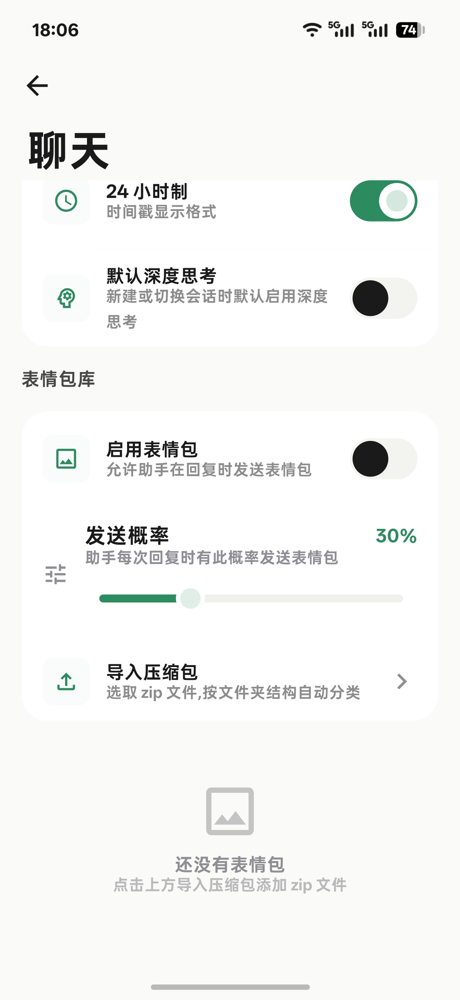
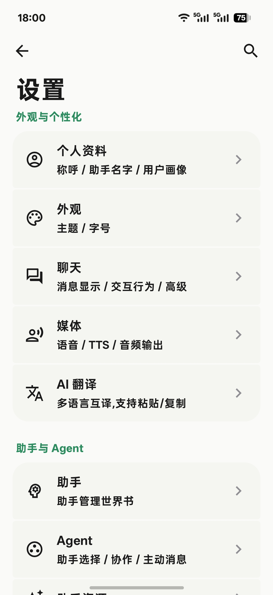
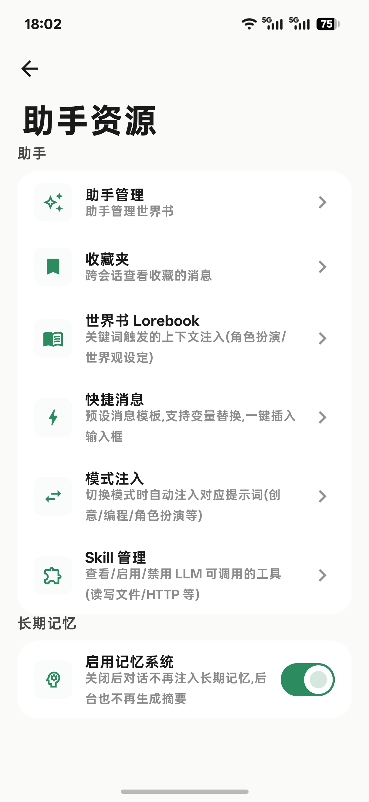
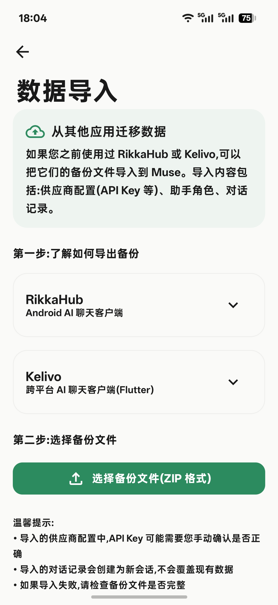

<p align="center">
  <picture>
    <source media="(prefers-color-scheme: dark)" srcset="app/src/main/res/drawable/ic_muse_logo.png">
    
  </picture>
</p>

<h1 align="center">Muse</h1>

<p align="center">
  <b>你的 AI 灵感伙伴</b><br>
  <i>4 层记忆 · 多模型 · 离线优先 · 可扩展</i>
</p>

<p align="center">
  <a href="README_EN.md">English</a> · <b>中文</b>
</p>

<p align="center">
  <a href="LICENSE"></a>
  
  
  
  <a href="https://github.com/5352124/Muse/actions/workflows/ci.yml"></a>
  <a href="https://github.com/5352124/Muse/releases/latest"></a>
</p>

<p align="center">
  <a href="#muse-是什么">Muse 是什么</a> ·
  <a href="#截图预览">截图预览</a> ·
  <a href="#功能特色">功能特色</a> ·
  <a href="#快速开始">快速开始</a> ·
  <a href="#许可证">许可证</a>
</p>

---

## Muse 是什么

大多数 AI 应用把每次对话当成初次见面——没有记忆、没有延续、没有个性。Muse 不一样。

Muse 是一个本地优先的 AI 对话应用，专为 Android 打造。它通过 4 层渐进式记忆系统建立与你持续的关系——记住你的偏好、你的历史、你在意的事。它让你自由选择底层模型（OpenAI、Anthropic、Gemini、DeepSeek，或任意 OpenAI 兼容接口）。它能说话、能搜索、能执行工具，甚至会在久未联系时主动发起对话。

Muse 还有一个独特的能力：它在每次回复前会写下"内心独白"(Mood)，包含 Vibe、Sparks、Reflections、Will 四个维度。这些思考不被直接展示给用户(默认折叠)，却能让你在展开时一窥 AI 的真实思考过程——它此刻的情绪、脑中闪过的联想、对自己的反思、以及接下来想做的事。

一切默认离线可用。无需注册账号。数据默认留在本地，联网功能按需开启。

---

## 截图预览

| 对话 | 记忆系统 | 主题系统 |
|:----:|:--------:|:--------:|
|  |  |  |

| 知识库 | 表情包 | 设置 |
|:------:|:------:|:----:|
|  |  |  |

| 助手资源 | 数据导入 |
|:--------:|:--------:|
|  |  |

---

## 功能特色

### 记忆系统

Muse 拥有 4 层记忆架构，从短期对话到长期深度处理逐层递进。

```
对话 --> 事实提取 --> 滚动摘要 --> 编译聚合 --> 深度处理
```

- **关键事实永不衰减**：医疗信息、财务数据、核心身份等重要性高的内容受保护，不随时间淡出
- **日常信息自然过期**：普通偏好和闲聊信息随使用频率降低自动衰减
- **来源可追溯**：每条记忆标注了来源会话和入库时间
- **你完全可控**：可在记忆面板手动调整重要程度、删除、筛选

### 多模型供应商

预置 20+ 供应商，覆盖三大类：

| 类别 | 供应商 |
|------|--------|
| 海外官方 | OpenAI、Anthropic、Gemini、Groq、Together、Mistral、OpenRouter、DeepInfra、Fireworks |
| 国内服务商 | DeepSeek、Qwen（千问）、GLM（智谱）、Moonshot（月之暗面）、Doubao（豆包）、Baichuan（百川）、Lingyi（零一）、StepFun（阶跃星辰） |
| 中转服务 | OpenCode、API2D、AIHubMix、DeepBricks + 自建模板 |

模型 ID 从各供应商的 `/models` 接口动态拉取，新模型上线无需更新 App。

### Mood 系统 -- 思想的四维空间

Muse 每次回复前会生成一个 `mood` 块，这是 AI 的"内心独白"——不是给用户看的正式回答，而是它真实闪过的念头。在界面上默认折叠为一个卡片，展开后可看到四个维度：

- **Vibe**（氛围）：AI 此刻最直接的感受与情绪。是轻松的、锐利的、还是沉思的?一句话概括当下的状态。
- **Sparks**（火花）：脑中自然冒出的联想或意象。这些火花方向差异很大——可能是一个比喻、一段回忆、一个新的角度、或者一个出乎意料的连接。每条火花都是不同的方向。
- **Reflections**（反思）：AI 对自己的质疑、不确定的点、或者想追问的洞察。这不是最终答案，而是思考过程中的犹豫与好奇。
- **Will**（意志）：此刻的意图与欲求。经过 Vibe 的感受、Sparks 的发散、Reflections 的反思之后，Will 是凝聚下来的一个方向——它想做什么、想往哪里去。

这四个维度从直觉到行动层层递进：先感受(Vibe)，然后发散(Sparks)，再反思(Reflections)，最后凝聚为意志(Will)。它们让每一次回复都不只是生成文本，而是经历了一次完整的思维过程。

### 多 Agent 协作

创建多个不同性格和专业方向的助手，在对话中随时委派任务：

- 输入栏 `@助手名` 即可委派
- 任务卡片可视化显示每一步委派的执行状态
- 支持团队模式，多助手轮询协作

### Skill 系统 + MCP 协议

- 20+ 内置工具：文件读写、联网搜索、知识库、日历、剪贴板、计算器、短信、闹钟、表情包等
- `.skill.json` 导入：创建和分享自定义 Skill，支持参数 Schema
- MCP 协议：连接外部 MCP Server 动态扩展工具能力（OAuth 鉴权、SSE 传输、自动发现）

### 交互与媒体

- **流式语音识别**：DashScope Paraformer / Step Whisper API；边说边出字，长按录音上滑取消，波形可视化
- **多模态输入**：ML Kit 离线中文 OCR；PDF 解析；自动识别 TXT/DOCX/EPUB；内置 DALL-E / Gemini 图片生成
- **联网搜索**：Jina AI Reader（Markdown 摘要）、Bing（Jsoup 结构化提取）、SearXNG/Tavily/自定义端点
- **主动消息**：久未联系时主动发起对话，发送间隔无级调节，时段控制，仅 Agent 会话触发
- **文字转语音**：系统 TTS / 云端 TTS（OpenAI/MiniMax/Edge），语速音高语言按助手独立配置

### 主题系统

6 套完整主题，每套均包含亮色与暗色模式：

| 主题 | 亮色 | 暗色 |
|:-----|:---:|:----:|
| 暖纸（默认） | 是 | 是 |
| 樱花 | 是 | 是 |
| 海洋 | 是 | 是 |
| 春 | 是 | 是 |
| 秋 | 是 | 是 |
| AMOLED | 是 | 是 |

另有 8 套色盲友好的精选配色用于自定义主题。每套主题完整定义所有 Material 3 颜色角色。

### 平台能力

- 桌面小部件：Glance Compose 实现，一键新建对话
- 嵌入式 Web 服务器：Ktor + JWT + mDNS，局域网 API 访问
- 配置导入：从 CherryStudio / Chatbox 一键迁移
- 备份与恢复：本地文件 + S3 / WebDAV 云同步
- 全文搜索：Room FTS5，对话历史即时检索
- 表情包库：导入 zip 压缩包自动分类，概率自动发送
- Markdown 富文本渲染：代码高亮(20+ 语言)、KaTeX 数学公式、Mermaid 流程图

### 安全与隐私

- 应用 PIN 锁（指数退避：5 次失败锁 30 秒），锁定期间拦截 Deep Link 防越权
- 敏感配置走 Android Keystore 加密（AES-256-GCM）
- 云备份用户密码加密（PBKDF2 + AES-256-GCM）
- WebView 净化 LLM 输出，移除 iframe、form、javascript: 伪协议
- 所有对话/记忆/知识库存储在本地 Room 数据库，无遥测、无分析、无数据收集
- 联网功能默认关闭，按需开启
- 崩溃日志仅存储在本地，安全模式下可手动导出

---

## 快速开始

> 想先试用？直接 [下载最新版 APK](https://github.com/5352124/Muse/releases/latest) 安装即可，无需自行构建。

### 前置要求

- Android 8.0（API 26）及以上设备
- 一个 AI 供应商的 API Key（OpenAI / Gemini / DeepSeek 等均可）

### 构建安装（仅开发者）

```bash
git clone https://github.com/5352124/Muse.git
cd Muse

# 调试构建
./gradlew :app:assembleDebug

# 安装到已连接设备
./gradlew :app:installDebug

# 正式发布构建
./gradlew :app:assembleRelease
```

APK 输出路径：`app/build/outputs/apk/release/app-{abi}-release.apk`

### 首次使用

1. 打开 App，引导页介绍核心功能
2. 设置你的称呼和助手的名字
3. 添加 AI 供应商 API Key（可使用预置模板快速配置）
4. 开始对话——从现在起 Muse 会记住一切

---

## 许可证

项目采用 **GNU General Public License v3**（GPL v3）。完整许可证文本见 [LICENSE](LICENSE)，第三方依赖库许可证列表见 [NOTICE](NOTICE)。